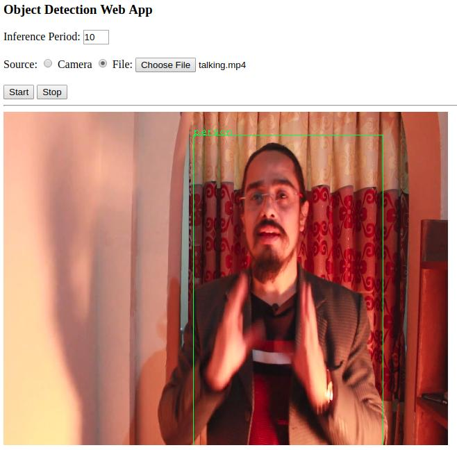
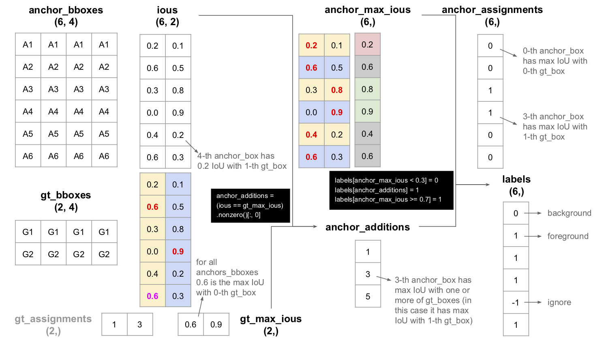
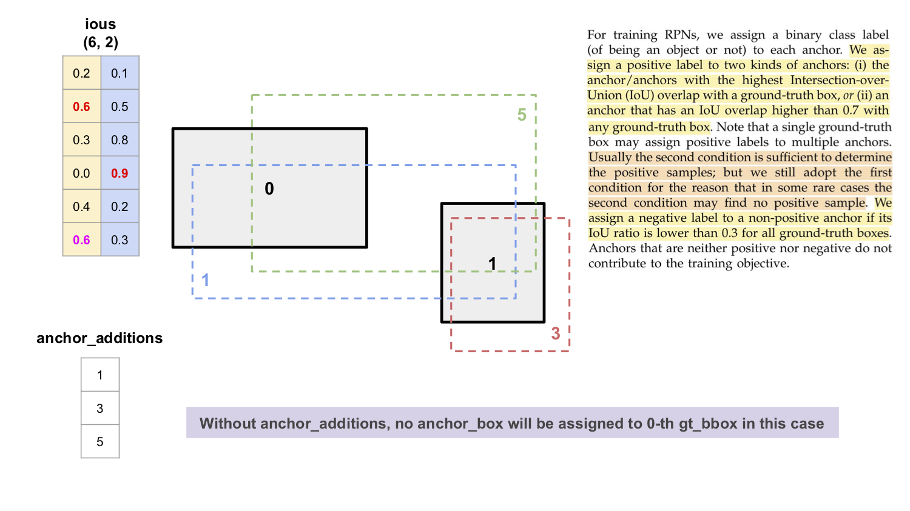
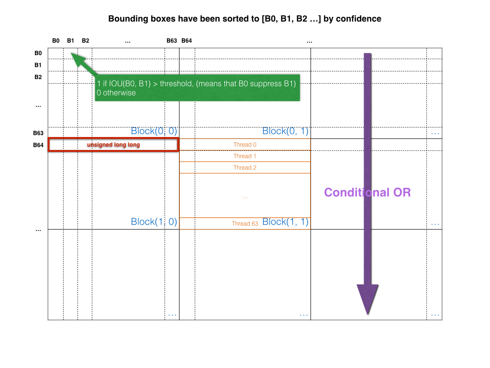
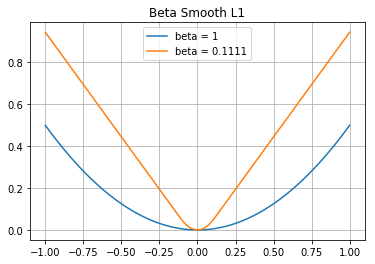

# Faster RCNN With RestNet 101

Implemenation of [Faster R-CNN](https://arxiv.org/pdf/1506.01497.pdf) in PyTorch for Crack & Corrosion detection.


## Demo

1. Download checkpoint from [here](https://drive.google.com/open?id=1mQ9HV5nmGBM06mg1DjKWqBuKoipoBe5U)
1. Follow the instructions in [Setup](#setup) 2 & 3
1. Run inference script
    ```
    $ python infer.py -s=coco2017 -b=resnet101 -c=/path/to/checkpoint.pth --image_min_side=800 --image_max_side=1333 --anchor_sizes="[64, 128, 256, 512]" --rpn_post_nms_top_n=1000 /path/to/input/image.jpg /path/to/output/image.jpg
    ```

## Features

* Supports PyTorch 1.0
* Supports `PASCAL VOC 2007` and `MS COCO 2017` datasets
* Supports `ResNet-18`, `ResNet-50` and `ResNet-101` backbones (from official PyTorch model)
* Supports `ROI Pooling` and `ROI Align` pooler modes
* Supports `Multi-Batch` and `Multi-GPU` training
* Matches the performance reported by the original paper
* It's efficient with maintainable, readable and clean code


## Requirements

* Python 3.6
* torch 1.0
* torchvision 0.2.1
* tqdm
    ```
    $ pip install tqdm
    ```

* tensorboardX
    ```
    $ pip install tensorboardX
    ```
    
* OpenCV 3.4 (required by `infer_stream.py`)
    ```
    $ pip install opencv-python~=3.4
    ```

* websockets (required by `infer_websocket.py`)
    ```
    $ pip install websockets
    ```


## Setup

1. Prepare data
    1. For `PASCAL VOC 2007`

        1. Download dataset

            - [Training / Validation](http://host.robots.ox.ac.uk/pascal/VOC/voc2007/VOCtrainval_06-Nov-2007.tar) (5011 images)
            - [Test](http://host.robots.ox.ac.uk/pascal/VOC/voc2007/VOCtest_06-Nov-2007.tar) (4952 images)

        1. Extract to data folder, now your folder structure should be like:

            ```
            easy-faster-rcnn.pytorch
                - data
                    - VOCdevkit
                        - VOC2007
                            - Annotations
                                - 000001.xml
                                - 000002.xml
                                ...
                            - ImageSets
                                - Main
                                    ...
                                    test.txt
                                    ...
                                    trainval.txt
                                    ...
                            - JPEGImages
                                - 000001.jpg
                                - 000002.jpg
                                ...
                    - ...
            ```

    1. For `MS COCO 2017`

        1. Download dataset

            - [2017 Train images [18GB]](http://images.cocodataset.org/zips/train2017.zip) (118287 images)
                > COCO 2017 Train = COCO 2015 Train + COCO 2015 Val - COCO 2015 Val Sample 5k
            - [2017 Val images [1GB]](http://images.cocodataset.org/zips/val2017.zip) (5000 images)
                > COCO 2017 Val = COCO 2015 Val Sample 5k (formerly known as `minival`)
            - [2017 Train/Val annotations [241MB]](http://images.cocodataset.org/annotations/annotations_trainval2017.zip)

        1. Extract to data folder, now your folder structure should be like:

            ```
            easy-faster-rcnn.pytorch
                - data
                    - COCO
                        - annotations
                            - instances_train2017.json
                            - instances_val2017.json
                            ...
                        - train2017
                            - 000000000009.jpg
                            - 000000000025.jpg
                            ...
                        - val2017
                            - 000000000139.jpg
                            - 000000000285.jpg
                            ...
                    - ...
            ```

1. Build `Non Maximum Suppression` and `ROI Align` modules (modified from [facebookresearch/maskrcnn-benchmark](https://github.com/facebookresearch/maskrcnn-benchmark))

    1. Install

        ```
        $ python support/setup.py develop
        ```

    1. Uninstall

        ```
        $ python support/setup.py develop --uninstall
        ```

    1. Test

        ```
        $ python test/nms/test_nms.py
        ```

        * Result

            

1. Install `pycocotools` for `MS COCO 2017` dataset

    1. Clone and build COCO API

        ```
        $ git clone https://github.com/cocodataset/cocoapi
        $ cd cocoapi/PythonAPI
        $ make
        ```
        > It's not necessary to be under project directory

    1. If an error with message `pycocotools/_mask.c: No such file or directory` has occurred, please install `cython` and try again

        ```
        $ pip install cython
        ```

    1. Copy `pycocotools` into project

        ```
        $ cp -R pycocotools /path/to/project
        ```


## Usage

1. Train

    * To apply default configuration (see also `config/`)
        ```
        $ python train.py -s=voc2007 -b=resnet101
        ```

    * To apply custom configuration (see also `train.py`)
        ```
        $ python train.py -s=voc2007 -b=resnet101 --weight_decay=0.0001
        ```

    * To apply recommended configuration (see also `scripts/`)
        ```
        $ bash ./scripts/voc2007/train-bs2.sh resnet101 /path/to/outputs/dir
        ```

1. Evaluate

    * To apply default configuration (see also `config/`)
        ```
        $ python eval.py -s=voc2007 -b=resnet101 /path/to/checkpoint.pth
        ```

    * To apply custom configuration (see also `eval.py`)
        ```
        $ python eval.py -s=voc2007 -b=resnet101 --rpn_post_nms_top_n=1000 /path/to/checkpoint.pth
        ```

    * To apply recommended configuration (see also `scripts/`)
        ```
        $ bash ./scripts/voc2007/eval.sh resnet101 /path/to/checkpoint.pth
        ```

1. Infer

    * To apply default configuration (see also `config/`)
        ```
        $ python infer.py -s=voc2007 -b=resnet101 -c=/path/to/checkpoint.pth /path/to/input/image.jpg /path/to/output/image.jpg
        ```

    * To apply custom configuration (see also `infer.py`)
        ```
        $ python infer.py -s=voc2007 -b=resnet101 -c=/path/to/checkpoint.pth -p=0.9 /path/to/input/image.jpg /path/to/output/image.jpg
        ```

    * To apply recommended configuration (see also `scripts/`)
        ```
        $ bash ./scripts/voc2007/infer.sh resnet101 /path/to/checkpoint.pth /path/to/input/image.jpg /path/to/output/image.jpg
        ```

1. Infer other sources

    * Source from stream (see also `infer_stream.py`)
        ```
        # Camera
        $ python infer_stream.py -s=voc2007 -b=resnet101 -c=/path/to/checkpoint.pth -p=0.9 0 5
        
        # Video
        $ python infer_stream.py -s=voc2007 -b=resnet101 -c=/path/to/checkpoint.pth -p=0.9 /path/to/file.mp4 5
        
        # Remote
        $ python infer_stream.py -s=voc2007 -b=resnet101 -c=/path/to/checkpoint.pth -p=0.9 rtsp://184.72.239.149/vod/mp4:BigBuckBunny_115k.mov 5
        ```
        
    * Source from websocket (see also `infer_websocket.py`)
        1. Start web server
            ```
            $ cd webapp
            $ python -m http.server 8000
            ```
            
        1. Launch service
            ```
            $ python infer_websocket.py -s=voc2007 -b=resnet101 -c=/path/to/checkpoint.pth -p=0.9
            ```
            
        1. Navigate website: `http://127.0.0.1:8000/`
        
            
            
            > Sample video from [Pexels](https://www.pexels.com/videos/)


## Notes

* Illustration for "find labels for each `anchor_bboxes`" in `region_proposal_network.py`

    

    

* Illustration for NMS CUDA

    

* Plot of beta smooth L1 loss function

    
    
 #For Inference Setup (Windows PC - CPU only)
1) Install Anaconda / Miniconda (64)bit
2) create a new conda virtual environment with below command
``
conda create -n fypfasterrcnn python=3.6
``
3) activate the environment with command
``
conda activate fypfasterrcnn
``
4) Clone this repository to local folder
5) Install pytorch CPU Version for windows with below command. (Assuming there is no cuda. there is cuda then follow pytroch website for installation)
``
conda install pytorch torchvision cpuonly -c pytorch
``
6) Run ``pip install -r requirements.txt`` from the command prompt.
7) Run ``python support/setup.py develop``
8) Run
``
python infer.py -s=voc2007 -b=resnet101 -c=model-90000.pth input.jpg output.jpg
``
